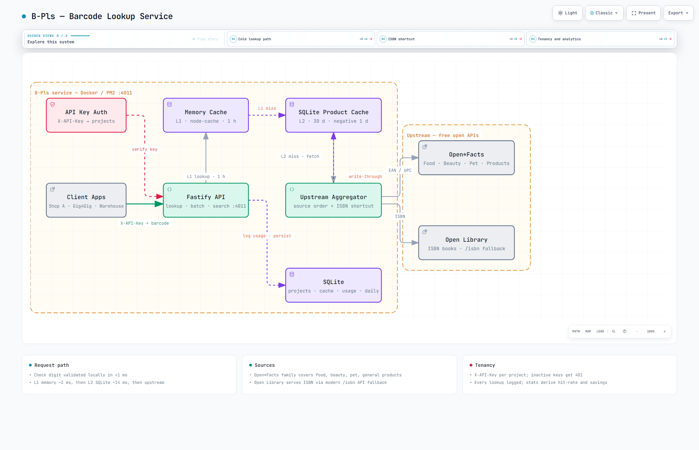

# B-Pls — Day 20

[](http://localhost:4011) [](https://fastify.dev) [](https://github.com/WiseLibs/better-sqlite3) [](https://nodejs.org) [](https://www.docker.com)

**Local:** `http://localhost:4011` — `GET /` → `{"service":"B-Pls","version":"1.0.0",…}` | `GET /health` → `{"status":"ok",…}`

Centralized barcode-to-product lookup microservice. **Fastify + SQLite + Node**. Single lookup point for the 30 Services challenge.

> **Docs:** [Interactive Architecture](docs/bpls-architecture.html) • [API](docs/API.md) • [Operations](docs/OPERATIONS.md) • [Architecture](docs/ARCHITECTURE.md) • [Changelog](CHANGELOG.md) • [TDS](B-Pls.md)

## Architecture — Interactive + Big Preview

[](docs/bpls-architecture.html)

> **Big preview** (2048×1320 light — 174 KB) — click for interactive pan/zoom/trace + light/dark + PNG export. Also available: [dark variant](docs/bpls-architecture.visual-check.2048x1320.dark.png) & [1440×900 light](docs/bpls-architecture.visual-check.1440x900.light.png). Full showcase: 9/9 checks, 0 errors, visual-check pass.

## Stack
- **Runtime:** Node.js 20+ (dev verified on 24, Docker on 20)
- **Framework:** Fastify 4 + `@fastify/cors` + `@fastify/helmet`
- **DB:** SQLite via better-sqlite3 (WAL) — projects + product cache + usage + daily summaries
- **Cache:** node-cache L1 (1 h) + SQLite L2 (30 d) + negative cache (1 d)
- **Upstream:** Open Food/Beauty/PetFood/Products Facts + Open Library (ISBN, modern `/isbn` fallback)
- **Auth:** per-project `X-API-Key` header, inactive keys 401

## Project Structure
```
.
├── src/server.js                # Fastify wiring, public /health + /
├── src/config.js                # .env → typed config (ports, TTLs, upstreams, limits)
├── src/db.js                    # SQLite access: projects, cache, search, logs, stats
├── src/cache.js                 # L1 memory cache (node-cache)
├── src/normalizer.js            # unified product + book schema
├── src/barcode/validator.js     # EAN/UPC/ISBN check digits
├── src/barcode/classifier.js    # source hinting (ISBN → books)
├── src/upstream/                # openfoodfacts (+beauty/pet/products), openlibrary, aggregator
├── src/routes/                  # lookup (+batch), validate, search, category, stats
├── src/middleware/auth.js       # X-API-Key → project
├── src/migrate.js src/seed.js   # CLI: migrate / seed Shop A + Gig4Gig keys
├── migrations/0001_init.sql     # 4 tables + indexes
├── test/selfcheck.js            # offline logic check (validator, classifier, normalizers)
├── docs/
│   ├── bpls-architecture.html   # interactive diagram (showcase, visual-check pass)
│   ├── bpls-architecture.visual-check.*.png  # light/dark previews
│   ├── API.md                   # full endpoint spec
│   ├── OPERATIONS.md            # deploy, tenants, maintenance, troubleshooting
│   └── ARCHITECTURE.md          # request flow, cache tiers, decisions
├── Dockerfile                   # node:20-slim + build tools (native sqlite compile)
├── docker-compose.yml           # :4011 + bpls_data volume
├── ecosystem.config.js          # PM2 single-fork app
├── .env.example                 # → .env (local secrets/config)
├── B-Pls.md                     # TDS v1.0.0
├── CHANGELOG.md                 # as-built deviations from spec
└── README.md
```

## Quick Start (10 mins)

```bash
# 1. Install
npm install

# 2. Configure
cp .env.example .env   # (Windows: copy manually — .env is git-ignored)
# IMPORTANT: set USER_AGENT with a real contact (Open*Facts policy)

# 3. Migrate
npm run migrate
# → ./data/bpls.db (also auto-migrates on boot)

# 4. Seed tenants
npm run seed
# → shop-a-bpls-key-2026 (all sources) + gig4gig-bpls-key-2026 (products+books)

# 5. Run
npm start
# → http://localhost:4011 (dev: npm run dev)

# ——— OR via Docker (production-parity) ———
docker compose up --build -d
docker compose exec bpls npm run seed
```

## API

All JSON. Base: `http://localhost:4011` — full spec in [docs/API.md](docs/API.md).
Auth: `X-API-Key: shop-a-bpls-key-2026` on everything except `/` and `/health`.

### GET /barcode/validate/:code ⭐ (no upstream call)
`200` → `{ valid, type, normalized, reason }` | types: `ean13 ean8 upca upce isbn13 isbn10`

### GET /barcode/:code
`200` → `{ success, barcode, barcode_type, cache: "memory"|"sqlite"|"miss", source, product, duration_ms }` | `400` invalid barcode | `404` not found in any source
Query: `?sources=food,books` (override order) · `?refresh=true` (bypass caches)

### POST /barcode/batch
```json
{ "barcodes": ["5449000000996", "9780140328721"], "sources": ["food", "books"] }
```
`200` → `{ success, total, found, duration_ms, results: [{ barcode, success, cache, product }] }` | `400` over 50 items

### GET /search?q=&limit=&offset= ⭐ (local cache)
`200` → `{ query, total, count, results }` | `400` missing `q`

### GET /category/:cat
`200` → `{ category, total, count, results }` — same mechanics as search

### GET /stats?days= ⭐ (per-project analytics)
`200` → `{ totals: { total_lookups, cache_hits, cache_hit_rate_percent, upstream_calls, upstream_saved, … }, by_source, memory_cache }`

### GET / , GET /health
Public → service index / `{ status: "ok", … }`

## Testing (cURL) — Local

```bash
BASE="http://localhost:4011"
KEY="shop-a-bpls-key-2026"

# validate (local only, <1 ms)
curl -H "X-API-Key: $KEY" $BASE/barcode/validate/5449000000996

# lookup Coca-Cola (1st = upstream miss, 2nd = memory ~2 ms)
curl -H "X-API-Key: $KEY" $BASE/barcode/5449000000996
curl -H "X-API-Key: $KEY" $BASE/barcode/5449000000996

# book by ISBN (bypass cache)
curl -H "X-API-Key: $KEY" "$BASE/barcode/9780140328721?refresh=true"

# batch
curl -X POST $BASE/barcode/batch -H "X-API-Key: $KEY" -H "Content-Type: application/json" \
  -d '{"barcodes":["5449000000996","9780140328721","3017620422003"]}'

# search + category (local cache) + stats
curl -H "X-API-Key: $KEY" "$BASE/search?q=Coca"
curl -H "X-API-Key: $KEY" "$BASE/category/cola"
curl -H "X-API-Key: $KEY" "$BASE/stats?days=30"

# offline logic check (no network)
node test/selfcheck.js
```

## Integration (for Shop A, Warehouse, Gig4Gig)

1. Scan barcode client-side, `GET {BPLS_URL}/barcode/:code` with `X-API-Key`
2. `200` → auto-fill from `product` (`name`, `brand`, `categories[0]`, `image_url`, `ingredients_text`)
3. `404` → flag for manual entry (result is negative-cached 1 day, don't retry in a loop)
4. Shipments: `POST /barcode/batch` (≤50), split `results` into received vs unknown
5. *Cache locally* — hit rate after warmup is ~90%+, upstream is the slow path

## Security Notes

- Auth: per-project opaque API keys in `X-API-Key`; `is_active = 0` kills a key instantly (401)
- No passwords or PII stored — only product JSON + anonymous usage counters
- Upstream calls carry a real-contact `USER_AGENT` (Open*Facts policy)
- `@fastify/helmet` headers + CORS on; no secrets in repo (`.env` git-ignored, `.env.example` only)
- Batch capped at 50, upstream calls individually timed-out at 10 s (no hung requests)

### Ponytail decisions (skipped → when to add)
- No Redis/ORM/search engine — node-cache + SQLite + LIKE is shorter; add when lookups outgrow one box
- No per-source upstream files with real logic — thin re-export wrappers; add when a source needs custom parsing
- No expiry scheduler — `purgeExpiredProducts()` exists; add a cron tick when the DB grows stale rows
- No multi-stage Docker slim-down — single stage with build tools; add when image size matters
- No refresh-token-style key rotation — add `last_used_at` + rotation when tenants demand it

## Deploy Checklist

- [ ] `.env` set (`USER_AGENT` with real contact, `DATABASE_PATH` correct)
- [ ] `migrations/0001_init.sql` applied (`npm run migrate` or auto on boot)
- [ ] `npm run seed` executed (or tenants inserted manually)
- [ ] `npm start` serves `:4011` (dry-run: validate → lookup → stats flow)
- [ ] Docker: `docker compose up --build -d` + exec seed + `GET /health`
- [ ] Only one server owns port 4011 (local `node` vs container collide)
- [ ] Share base URL + API key with consumers

## License
MIT — Emmanuel Phiri. Reuse for all 30 services.
